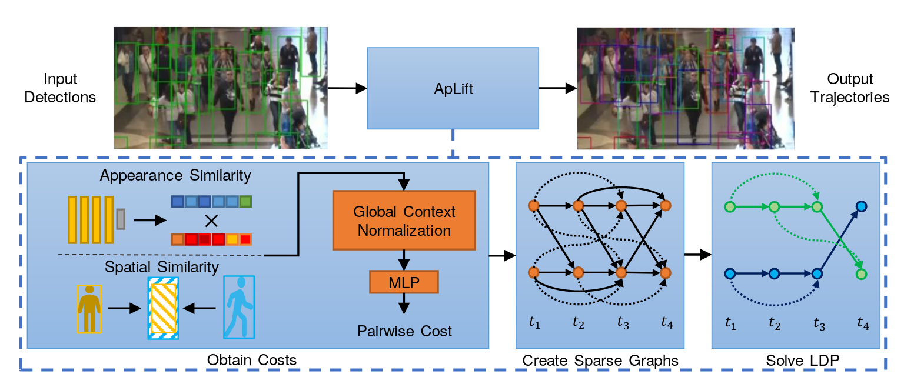

# Making Higher Order MOT Scalable: An Efficient Approximate Solver for Lifted Disjoint Paths

Implementation of ICCV21 [paper](https://arxiv.org/abs/2108.10606) *Making Higher Order MOT Scalable: An Efficient Approximate Solver for Lifted Disjoint 
Paths* (
[Andrea Hornakova](https://www.mpi-inf.mpg.de/departments/computer-vision-and-machine-learning/people/andrea-hornakova), 
[Timo Kaiser](http://www.tnt.uni-hannover.de/en/staff/kaiser/), 
[Paul Swoboda](https://www.mpi-inf.mpg.de/departments/computer-vision-and-machine-learning/people/paul-swoboda/)
[Michal Rolinek](https://www.is.mpg.de/~mrolinek), 
[Bodo Rosenhahn](http://www.tnt.uni-hannover.de/en/staff/rosenhahn/), 
[Roberto Henschel](http://www.tnt.uni-hannover.de/staff/henschel/)
)





The introduced approximate solver without tracking framework can be found [here](https://github.com/AndreaHor/LPMP)!


## Install repository
We use anaconda. Please run the follwing commands to initiate the repository:

```shell script
git clone https://github.com/TimoK93/ApLift.git
cd ApLift
conda create -n aplift python=3.6
conda activate aplift
```

Run the following commands to install repositories and the approximate solver:
```shell script
pip install torch==1.6.0
pip install torchvision
pip install numpy
pip install opencv-python scipy attrdict motmetrics tqdm pyyaml matplotlib
pip install git+https://github.com/AndreaHor/LPMP.git@afb5b1bb0564732c6f5fac5aca247a4fca5cf066
```

## Prepare Data ##
To run the framework, some data needs to be prepared. Follow the instructions bellow **or** run the data preparation script.
```shell script
python prepare_datasets.py 
```

### Extract models.zip
Our pretrained classifiers are available [here](https://www.tnt.uni-hannover.de/de/project/MPT/data/MakingHigherOrderMOTScalable/).
To use them, unzip it into *./data/*. 

### Download required MOTChallenge datasets and features
The datasets used in the paper are provided by [www.motchallenge.net](www.motchallenge.net). For the evaluation the 
original data is preprocessed by [Tracktor](https://github.com/phil-bergmann/tracking_wo_bnw) as described in the paper.

Additional to the datasets our tracker needs visual features generated by [DG-Net](https://github.com/NVlabs/DG-Net) 
and optical flow between consecutive frames in video sequences. 

We wrapped the required features and datasets for the original and preprocessed datasets into ZIP archives. Download is
available at:

 - [MOT15](https://www.tnt.uni-hannover.de/de/project/MPT/data/MakingHigherOrderMOTScalable/MOT15.zip)
 - [MOT15-Preprocessed](https://www.tnt.uni-hannover.de/de/project/MPT/data/MakingHigherOrderMOTScalable/MOT15-Preprocessed.zip)
 - [MOT17](https://www.tnt.uni-hannover.de/de/project/MPT/data/MakingHigherOrderMOTScalable/MOT17.zip)
 - [MOT17-Preprocessed](https://www.tnt.uni-hannover.de/de/project/MPT/data/MakingHigherOrderMOTScalable/MOT17-Preprocessed.zip)
 - [MOT20](https://www.tnt.uni-hannover.de/de/project/MPT/data/MakingHigherOrderMOTScalable/MOT20.zip)
 - [MOT20-Preprocessed](https://www.tnt.uni-hannover.de/de/project/MPT/data/MakingHigherOrderMOTScalable/MOT20-Preprocessed.zip)
 
After successfull download, unzip the files to */data/tmp/*.

## Training/inference pipeline
You can run the training/inference pipeline using scripts *main.py* and *run_full_dataset.py*.

To train a pipeline on a set of sequences and evaluate it on a sequence, a configuration file is needed.
You can find configuration files in *./config*. Please update the configs to your desire.
The pipeline is then started by running *main.py*
```shell script
python main.py .config/your_slected_config.yaml
```
The results are stored into a working directory e.g. *./results/some_dir*.
 You can use a preprained model by copying the model checkpoint into the working directory before starting the pipeline!

If you want to run the pipeline for a whole dataset, you can use the script *run_full_dataset.py* which calls *main.py*
with all sequence combinations for a *leave-one-out* validation.
```shell script
python run_full_dataset.py .config/your_slected_config.yaml
```

The training pipeline does not use any post-processing. To apply post-processing, use one of the following commands:
```shell script
python3 run_postprocessing.py --working_directory ./result/MyExampleWorkingDirectory --challenge MOT17
python3 run_postprocessing.py --working_directory ./result/MyExampleWorkingDirectory2 --challenge MOT20

``` 

After training and inference you can evaluate the results in a working directory using the following command:
```shell script
python3 evaluate.py --working_directory ./result/MyExampleWorkingDirectory --challenge MOT17
``` 

## Parallelization
The solver performance on crowded scenes (MOT20) is archieved by parallel computation of sub-problems of the global 
problem instance. For the paper, we solved the problems in a big computation cluster in parallel. While this is not available for
everyone, the parallel cluster computing is removed in this repository. Here, the solver solves up to 4 sub-problems in parallel
on the computing machine.

To speed up the solver with your cluster, please look into the file *./src/LiftedSolver.py* and modify the *Processor* class.

## Citation
If you use our work in your research, please cite our publication:

```text
@inproceedings { HorKai2021,
  author = {Andrea Hornakova* and Timo Kaiser* and Michal Rolinek and Bodo Rosenhahn and Paul Swoboda and Roberto Henschel and (* equal contribution)},
  title = {Making Higher Order MOT Scalable: An Efficient Approximate Solver for Lifted Disjoint Paths},
  booktitle = {International Conference on Computer Vision (ICCV)},
  year = {2021},
  month = {Oct}
}
```
